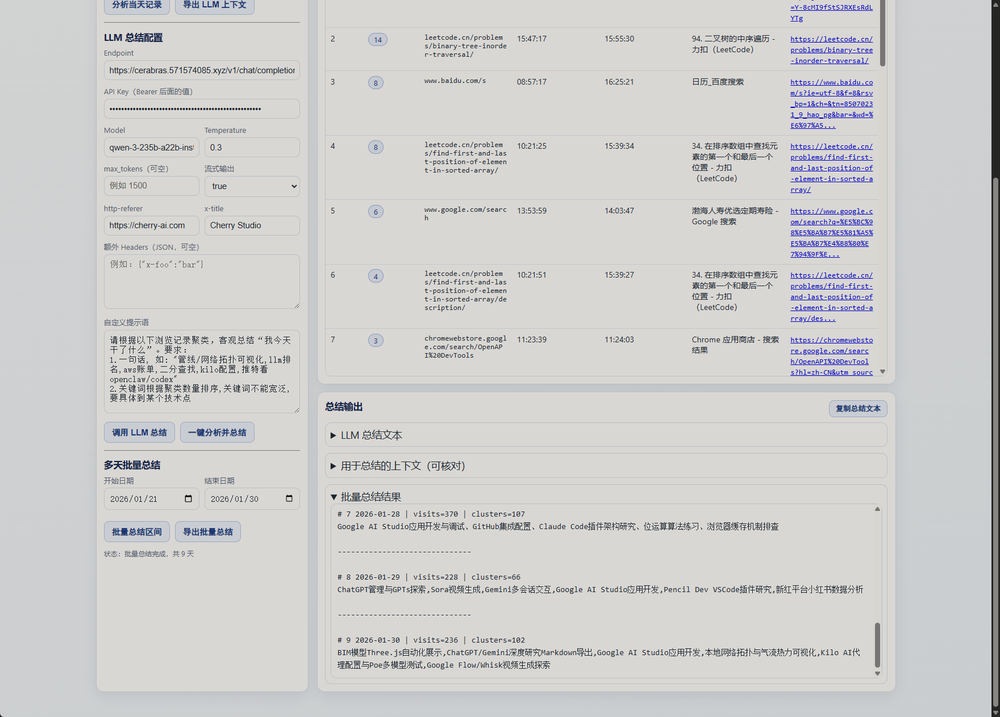

# 浏览历史按天聚类总结（单文件网页）

一个纯前端工具：导入浏览器历史导出的 JSON 文件，按日期筛选、按网页聚类，并可调用 LLM 生成“当天干了什么”的总结。

## 在线使用

部署到 GitHub Pages 后可直接访问：

- `https://<你的GitHub用户名>.github.io/<仓库名>/`

## 效果图

## 隐私说明

- 本仓库**不会上传**你的 `history.json`。
- 已在 [`.gitignore`](.gitignore) 中忽略 `history.json`。
- 你的历史文件默认只在浏览器本地处理（你主动调用 LLM 时，才会把聚类后的上下文发送到你配置的接口）。

## history.json 来源

建议使用 Chrome 扩展导出：

- Export Chrome History  
  <https://chromewebstore.google.com/detail/export-chrome-history/dihloblpkeiddiaojbagoecedbfpifdj>

导出后得到的 JSON 文件即可在本工具中导入分析。

## 功能

- 单天分析：自动分析 + 一键分析并总结
- 多天批量：按日期区间批量调用 LLM
- 聚类方式：域名+路径 / 域名 / 完整 URL
- 自定义提示词与 LLM 参数
- 一键复制总结文本
- 配置持久化（刷新保留）

## 本地使用

直接用浏览器打开 [`index.html`](index.html) 即可。

## 主要文件

- [`index.html`](index.html)：GitHub Pages 入口页面
- [`daily_history_summary.html`](daily_history_summary.html)：同功能页面（开发保留）
- [`.gitignore`](.gitignore)：隐私与导出文件忽略规则
